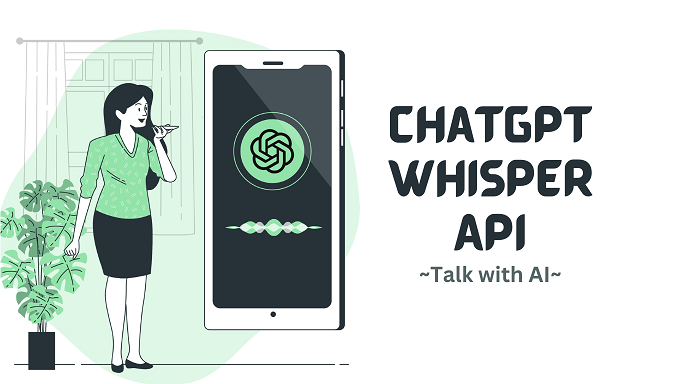
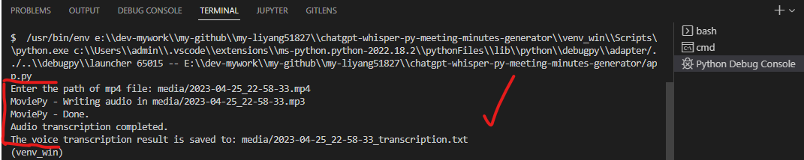

# chatgpt-whisper-py-meeting-minutes-generator

> Generate meeting minutes from video / audio files using `ChatGPT` &amp; `Whisper` API



## How-To-Run (`Windows 10`)

### 🚩 Check **python** installation

```cmd
D:\> python -V

REM Python 3.11.0
```

### 🚩 Create **virtual environment**

```cmd
D:\> py -m venv venv_win
```

### 🚩 Activate **venv** and install **python** packages

```cmd
REM activate
D:\> venv_win\Scripts\activate.bat

REM for convenience
D:\> activate_win.bat

REM install packages from requirements
(dfenv_win) D:\> py -m pip install -r requirements.txt
```

### 🚩 Run **python** script

```cmd
(dfenv_win) D:\> py app.py

REM Enter the path of mp4 file: media/2023-04-25_22-58-33.mp4
```

### 🚩 Deactivate **venv**

```cmd
REM deactivate
(dfenv_win) D:\> venv_win\Scripts\deactivate.bat

REM for convenience
(dfenv_win) D:\> deactivate_win.bat

REM deactivated now
D:\> dir
```



```
Yes, it's red. Hello sir. Hey, Lee, how are you? Good evening. Good morning, sir. So, how do you feel? Are you okay? It's okay. I cannot. Let me share my screen. Even if you can see my screen. Yeah, okay. So, the accountants and the accountants confirmed me that we are not representing, but we are pushing for the payment. That is what they told. It's a bad impression for you and me as well. Yeah. Because I choose you to work over here. Yeah, yeah. Thank you. They said it's happening from last milestone itself. Okay. So, let me, because right now we are working on the milestone, right? Yeah, I know. So, we will be focusing on the milestone work.
...
```

---

&copy; 2023 @liyang51827

All Rights Reserved.
